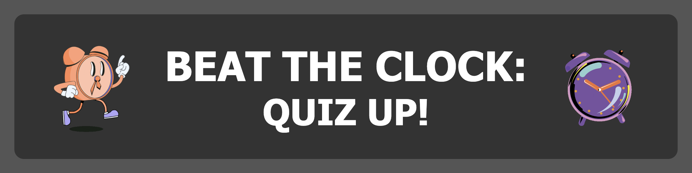

<!-- Readme top-->

<!-- Project shields -->

<!-- centered shields -->

  [![Stargazers][stars-shield]][stars-url]
  [![Issues][issues-shield]][issues-url]
  [![MIT License][license-shield]][license-url]
  [![LinkedIn][linkedin-shield]][linkedin-url]

<!-- Readme Header -->

  

#
<h2 align="center">Beat The Clock! A JS Quiz with timer and leaderboard.</h2>

UNFINISHED DRAFT ONLY

  

    A fun, timed JS quiz app where you must answer the questions before the timer runs out.  Battle your way to the top of the leaderboard!
     
    <a href="https://github.com/Matt-Jones-Developer/beat_the_clock/"><strong>Explore the docs »</strong></a>
     
     
    <a href="https://github.com/Matt-Jones-Developer/beat_the_clock">View Project</a>
    ·
    <a href="https://github.com/Matt-Jones-Developer/beat_the_clock/issues">Report Bug</a>
    ·
    <a href="https://github.com/Matt-Jones-Developer/beat_the_clock/issues">Request Feature</a>
    ·
    <a href="https://github.com/Matt-Jones-Developer?tab=repositories">Check out my work</a>
    ·
  

#

<!-- TABLE OF CONTENTS -->

  
Table of Contents

  <ol>
    <li>
      <a href="#about-the-project">About The Project</a>
      <ul>
        <li><a href="#built-with">Built With</a></li>
      </ul>
    </li>
    <li>
      <a href="#getting-started">Getting Started</a>
      <ul>
        <li><a href="#prerequisites">Prerequisites</a></li>
        <li><a href="#installation">Installation</a></li>
      </ul>
    </li>
    <li><a href="#usage">Usage</a></li>
    <li><a href="#roadmap">Roadmap</a></li>
    <li><a href="#contributing">Contributing</a></li>
    <li><a href="#license">License</a></li>
    <li><a href="#contact">Contact</a></li>
    <li><a href="#acknowledgments">Acknowledgments</a></li>
  </ol>

<!-- ABOUT THE PROJECT -->
## About The Project

TODO:

## Overview
 
This weeks task was to build a quiz app.  For some reason I have really struggled with this one.

I had to go and see family this weekend, so haven't had anywhere near enough time to work on this.  Sadly I will be submitting what I have, currently incomplete and not fully working at all.  I will have to re-submit this to improve my grade once the logic has been achieved.

I felt like a lot of what we were shown in class this week should of helped me.  But I found it hard to absorb it all this week, I am also not in a good space, conducive to working at all, so it is what it is.

Very disappointed and cannot believe this project beat me.

I started out really strong, developed the timer component in a morning, before even noticing there was a tutorial on it that morning,  I was really proud I figured it out on my own. 

My leaderboard testing - works brilliantly:
- I wanted to make it like an arcade scoreboard; the 'default' players have various names and scores already stored in the array.
- the players score is checked against the leaderboard and if they beat a score, get added to it.

    - add to score
    - newPlayer object is created that holds 3 initials, a score and a playcounter.
    - when score checked, if the player beats the lowest position score, they are asked to enter a username and the player object is successfully added to the array
    - the array correctly sorts positions 
    - if the user makes the highest score, too.

    - It took me 3 days to get those 2 elements down and working correctly.  I spent another morning working on the css and html content; as I wanted to use multiple pages 'start page' 'main-game' and 'leaderboard' and styled each page, very roughly.

#

<!-- the product -->

## The Product

Product screenshot:

[![Product Name Screen Shot][product-screenshot]](https://github.com/Matt-Jones-Developer/beat_the_clock)

## Criteria

GIVEN I am taking a code quiz
WHEN I click the start button
THEN a timer starts and I am presented with a question
WHEN I answer a question
THEN I am presented with another question
WHEN I answer a question incorrectly
THEN time is subtracted from the clock
WHEN all questions are answered or the timer reaches 0
THEN the game is over
WHEN the game is over
THEN I can save my initials and score

#

(<a href="#readme-top">back to top</a>)

### Built With:

<!-- languages logos -->

![js-logo]::: [![JavaScript]][javascript-url] ![html5-logo]::: [![HTML5]][html5-url] ![css-logo]::: [![CSS]][css-url]

(<a href="#readme-top">back to top</a>)

#

<!-- GETTING STARTED -->
## Getting Started

This project has multiple html page templates, separated component js files.  The quiz will run in your browser.

See the tests countdown.js and leaderboard.js to those working components - I have yet to get this app finished.

#
### Prerequisites

N/A

#

### Installation

No installation required.  Just load your browser.

----------------------------------

<!-- USAGE EXAMPLES -->
## Usage and Screenshots

Screenshot of the programs output with
fully responsive design:

![startpage-screenshot]
![main-game-screenshot]
![leaderboard-screenshot]

Console log:

![console-output-screenshot]

(<a href="#readme-top">back to top</a>)

----------------------------------

<!-- ROADMAP -->
## Roadmap

1. complete all initial criteria - must get all the logic working this week 
2. improve on the existing features and add new ones
3. improve the UI and add my UX design principles [DONE]

(<a href="#readme-top">back to top</a>)

#

<!-- UX/UI DESIGN -->
## UX/UI Design

Screenshot of the web apps UI design stage:

[![Design Screen Shot][wireframe-screenshot]](https://github.com/Matt-Jones-Developer/beat_the_clock)
[![Design Screen Shot][wireframe-screenshot2]](https://github.com/Matt-Jones-Developer/beat_the_clock)
[![Design Screen Shot][wireframe-screenshot3]](https://github.com/Matt-Jones-Developer/beat_the_clock)
[![Design Screen Shot][wireframe-screenshot4]](https://github.com/Matt-Jones-Developer/beat_the_clock)

(<a href="#readme-top">back to top</a>)

#

<!-- CONTRIBUTING -->
## Contributing

N/A

#

<!-- LICENSE -->
## License

Distributed under the MIT License. See `LICENSE.txt` for more information.

(<a href="#readme-top">back to top</a>)

#

<!-- CONTACT -->
## Contact

Matt Jones - [@glitchy81_dev](https://twitter.com/glitchy81_dev)

#

## Project links

Project Repo Link: [https://github.com/Matt-Jones-Developer/beat_the_clock](https://github.com/Matt-Jones-Developer/ultimate_beat_the_clock)

Deployed Project Link: [https://matt-jones-developer.github.io/beat_the_clock](https://matt-jones-developer.github.io/beat_the_clock)

(<a href="#readme-top">back to top</a>)

<!-- ACKNOWLEDGMENTS -->
## Acknowledgments

* [Developed from this original README Template](https://github.com/othneildrew/Best-README-Template)

(<a href="#readme-top">back to top</a>)

<!-- MARKDOWN LINKS & IMAGES -->
<!-- https://www.markdownguide.org/basic-syntax/#reference-style-links -->
[contributors-shield]: https://img.shields.io/github/contributors/matt-jones-developer/beat_the_clock.svg?style=for-the-badge
[contributors-url]: https://github.com/matt-jones-developer/beat_the_clock/graphs/contributors
[forks-shield]: https://img.shields.io/github/forks/matt-jones-developer/beat_the_clock.svg?style=for-the-badge
[forks-url]: https://github.com/Matt-Jones-Developer/beat_the_clock/network/members
[stars-shield]: https://img.shields.io/github/stars/matt-jones-developer/beat_the_clock.svg?style=for-the-badge
[stars-url]: https://matt-jones-developer.github.io/beat_the_clock/stargazer
[issues-shield]: https://img.shields.io/github/issues/matt-jones-developer/beat_the_clock.svg?style=for-the-badge
[issues-url]: https://github.com/Matt-Jones-Developer/beat_the_clock/issues
[license-shield]: https://img.shields.io/github/license/matt-jones-developer/beat_the_clock.svg?style=for-the-badge
[license-url]: https://github.com/Matt-Jones-Developer/beat_the_clock/blob/main/LICENSE.txt
[linkedin-shield]: https://img.shields.io/badge/-LinkedIn-black.svg?style=for-the-badge&logo=linkedin&colorB=555
[linkedin-url]: www.linkedin.com/in/matt-jones-zx81
[startpage-screenshot]: assets/images/screenshots/quiz_start_screen.png
[main-game-screenshot]: assets/images/screenshots/in-game-testing.png
[leaderboard-screenshot]: assets/images/screenshots/quiz_leaderboard.png
[product-screenshot]: assets/images/screenshots/quiz_start_screen.png
[console-output-screenshot]: assets/images/screenshots/console_output_screenshot.png
[wireframe-screenshot]: ./assets/images/wireframing%20UI%20Design/app_flow.png
[wireframe-screenshot2]: ./assets/images/wireframing%20UI%20Design/start_home_screen.png
[wireframe-screenshot3]: ./assets/images/wireframing%20UI%20Design/main_game_screen.png
[wireframe-screenshot4]: ./assets/images/wireframing%20UI%20Design/leaderboard_hof.png
[tablet-screenshot1]: ./assets/images/screenshots/pw_gen_ipad-screenshot.png
[mobile-screenshot1]: ./assets/images/screenshots/pw_gen_mobile-screenshot1.png
[mobile-screenshot2]: ./assets/images/screenshots/pw_gen_mobile-screenshot2.png
[javascript-url]: https://www.javascript.com
[html5-url]: https://html5.org/
[css-url]: https://www.w3.org/Style/CSS/Overview.en.html
[js-logo]: assets/images/logos/js.svg
[html5-logo]: assets/images/logos/html5.svg
[css-logo]: assets/images/logos/css3.svg
